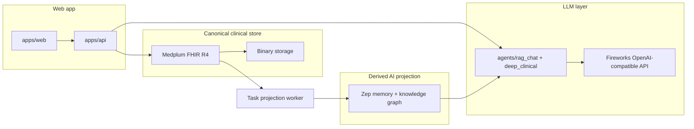
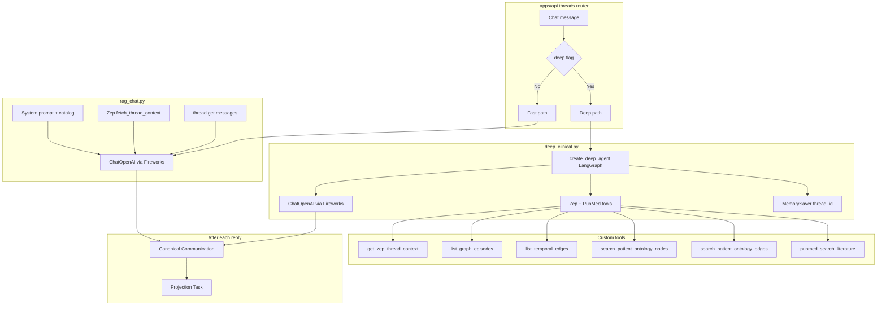
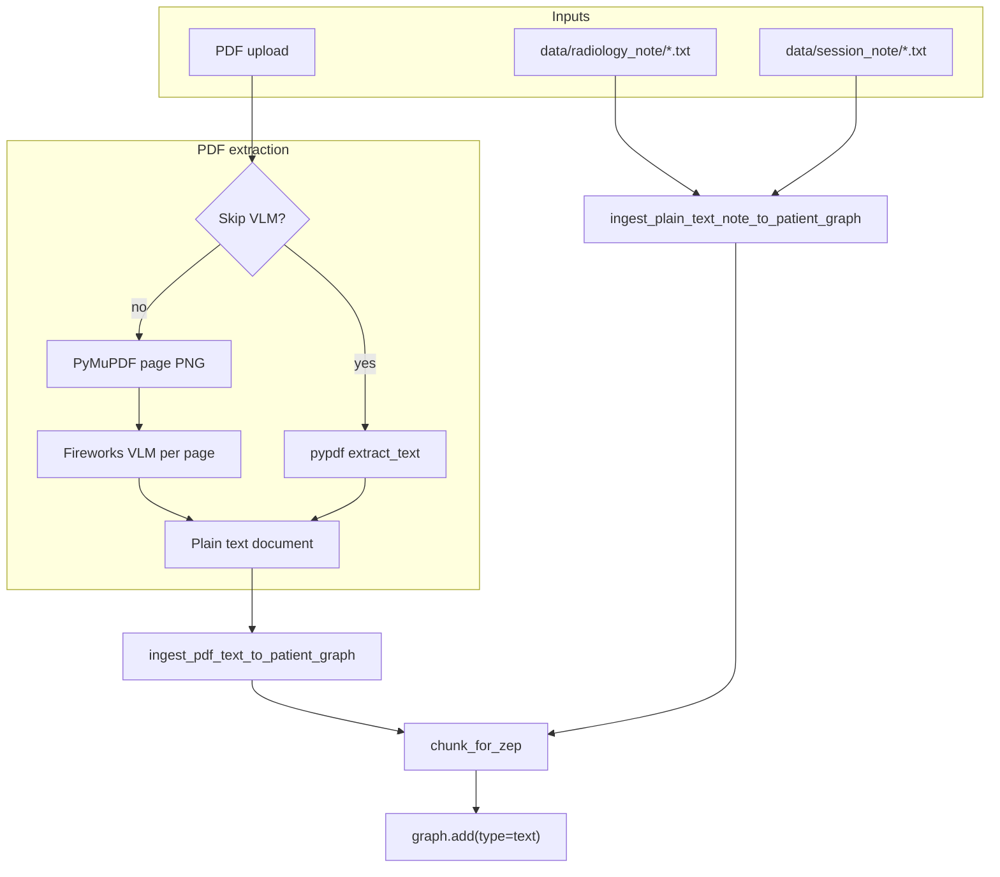

# MedTrace AI

**Clinical decision support / cognitive aid** — surfaces patterns, timelines, and test ideas for the clinician to validate. Not a certified medical device; agent and vision-ingest output are demo-grade.

One FastAPI service and one React app, sharing the `src/medtrace_agent/` Python package (`medtrace-agent` 0.2.0).

| Surface | Path | Port |
|---------|------|------|
| API (clinical + imaging) | `apps/api/` (`apps.api.main:app`) | 8001 |
| Web app | `apps/web/` — `/`, `/patients/:id`, `/imaging`, `/session` | 3000 |
| Voice prototype | `services/transcription/` (optional; backs `/session`) | 8010 + 4000 |

- **Clinical** — **Medplum FHIR R4 is the only clinical store** for patients, clinical facts, source documents, and transcripts. **Zep Cloud** is a permanent derived AI-memory/knowledge projection; **Fireworks AI** supplies LLM/VLM calls.
- **Imaging** — DICOM upload, MedSAM2 segmentation, draft reports. **Runs fully in mock mode with no secrets** — easiest path to an end-to-end demo.

---

## Quick start

PowerShell:

```powershell
python -m venv .venv
.venv\Scripts\Activate.ps1
python -m pip install -e ".[dev,imaging]"

npm install
npm --prefix apps/web ci

Copy-Item .env.example .env
# Start Medplum, create a project + ClientApplication at http://localhost:3002,
# then fill MEDPLUM_CLIENT_ID / MEDPLUM_CLIENT_SECRET. Add ZEP / FIREWORKS for AI features.

npm run medplum:up
npm run medplum:bootstrap
npm run medplum:seed

npm run dev          # api :8001, web :3000
```

macOS/Linux:

```bash
python -m venv .venv
source .venv/bin/activate
python -m pip install -e ".[dev,imaging]"

npm install
npm --prefix apps/web ci

cp .env.example .env
# Start Medplum, create a project + ClientApplication at http://localhost:3002,
# then fill MEDPLUM_CLIENT_ID / MEDPLUM_CLIENT_SECRET. Add ZEP / FIREWORKS for AI features.
# Imaging works without secrets (deterministic mock).

npm run medplum:up
npm run medplum:bootstrap
npm run medplum:seed
npm run dev          # api :8001, web :3000
```

| Script | Starts |
|--------|--------|
| `npm run dev` | api + web + Medplum→Zep projection worker |
| `npm run dev:api` | FastAPI only |
| `npm run dev:web` | Vite only |
| `npm run dev:transcription` | voice backend (8010) + CopilotKit runtime (4000) |
| `npm run medplum:up` / `medplum:down` / `medplum:logs` | pinned local Medplum stack |
| `npm run medplum:bootstrap` / `medplum:seed` | verify credentials / idempotently import synthetic fixtures |
| `npm run lint` / `npm run build` | TypeScript check / Vite build (`apps/web`) |
| `npm run test:py` | `python -m pytest -m "not integration"` in the activated venv |

Health check: `curl http://127.0.0.1:8001/api/health`
Web (Vite binds IPv6 `localhost`): `curl http://localhost:3000`

---

## Monorepo layout

```
apps/
  api/               FastAPI — clinical + imaging (8001)
  web/               React/Vite UI — dashboard, imaging, session (3000)
services/
  transcription/     Voice/CopilotKit prototype (8010, 4000)
src/medtrace_agent/  Shared package (Medplum, Zep, ingest, agents, imaging, ontology)
tests/               Pytest suite (covers the shared package)
infra/medplum/       Pinned local Medplum/PostgreSQL/Redis Compose stack
mock/patient_data/   Synthetic Medplum seed fixtures
data/                Runtime data and optional historical JSON imports (mostly gitignored)
notebooks/           Colab workflows (MedGemma QLoRA training + evaluation)
scripts/             Medplum bootstrap/seed, projection worker, note ingest, model probe
```

---

## Architecture



- **Web** talks only to port 3000; Vite proxies `/api` and `/data` to the API, and `/api/copilotkit` to the transcription runtime.
- **Agent** — default `chat_with_memory` (one LLM call with Zep context + document catalog). Optional Deep Agent (`deep` flag) uses Zep tools + PubMed.
- **Medplum** — canonical `Patient`, clinical resources, `Binary` + `DocumentReference`, `Communication` transcripts, `Provenance`, and durable `Task` work.
- **Zep** — subordinate semantic memory and knowledge projection. Dashboard reads and transcript ownership never depend on Zep availability.

### LLM layer

Every chat and PDF-vision call goes through `fireworks_chat_client()` (`medtrace_agent.fireworks_config`) against an **OpenAI-compatible** endpoint — **Fireworks AI** by default (`FIREWORKS_BASE_URL`, `FIREWORKS_MODEL`, `FIREWORKS_VL_MODEL`).

- `FIREWORKS_VLM_API` — `chat` (`/v1/chat/completions`, default) or `completions` (`<image>`-prompt style).
- `FIREWORKS_REASONING_EFFORT=none` — keeps Qwen3-style CoT out of `reasoning_content` so JSON/text lands in `content`.
- Any OpenAI-compatible host works if you repoint those env vars (including a self-hosted [vLLM](https://docs.vllm.ai/en/latest/serving/openai_compatible_server/) server).

Fireworks retires serverless model ids often; a stale id fails as `404 Model not found`, not auth. Run `scripts/fireworks_probe_models.py` to list what your key can reach.

### AI agent paths

How the API chooses between **fast RAG chat** and the **Deep Clinical Agent** (`deep` on `POST /api/threads/{id}/messages`):



| Path | Role |
|------|------|
| **Fast** | Single `chat_with_memory` call: system prompt + Zep context + recent messages + document catalog. No tool loop. |
| **Deep** | `create_deep_agent` with Zep graph tools + PubMed (`integrations/pubmed` via NCBI E-utilities). Slower; educational demo only. |
| **PubMed** | Set `NCBI_EMAIL` (and optionally `NCBI_API_KEY`) for reliable E-utilities access. |

### Imaging

`MedSAM2Service` / report adapters resolve in order: **HTTP endpoint** → **local adapter** → **deterministic mock**. Reports use Qwen VL via Nebius when `NEBIUS_API_KEY` is set; otherwise mock. DICOM previews use pydicom with rescale + windowing; ROI prompts are normalized 0–1 and converted to pixels server-side.

Sample DICOM for uploads (ships with pydicom):

```bash
.venv/bin/python -c "import pydicom.data,os;print(os.path.join(os.path.dirname(pydicom.data.__file__),'test_files','MR_small.dcm'))"
```

## Zep projection model

A Medplum `Patient` retains `zep_user_id` as a stable identifier. Canonical turns are child `Communication` resources under a header `Communication`; a durable `Task` projects completed turns and extracted document text into Zep.

### Zep thread mirror (short dialog + rolling context)

- `thread.get_user_context(thread_id)` — synthesized context for the model.
- `thread.get(thread_id, lastn=…)` — recent messages for LangChain history.
- `thread.add_messages` — appends user + assistant turns after each reply.

New thread = new conversation, same user (long-term recall stays attached to the patient).

### Graph (episodes, facts, ontology)

- `graph.add` — PDF/note chunks as text episodes (metadata: `doc_id`, filename, `kind`, …).
- `graph.set_ontology` — clinical entity/edge types (`AUTO_APPLY_ZEP_ONTOLOGY=true` at API startup).
- `graph.search` / episode + edge APIs — power derived clinical views and Deep Agent tools.

The ontology supports optional Zep-powered AI tools. FHIR dashboard reads remain available if Zep or ontology registration is unavailable. Re-apply with `scripts/apply_ontology.py`.

---

## Chat turn sequence

1. React supplies a retry-safe `request_id`.
2. The user turn is conditionally written to canonical Medplum `Communication` storage.
3. The model receives the Medplum transcript and FHIR chart snapshot, supplemented by Zep context when available.
4. The assistant turn is written to Medplum; a durable `Task` projects the turn into Zep.
5. Generation failure leaves the user turn intact; retrying the same `request_id` does not duplicate it.

---

## Document ingestion

**Default (vision):** each PDF page is rasterized (PyMuPDF) and sent to the Fireworks multimodal model; JSON is validated then serialized to plain text.

**Skip VLM:** `pypdf` reads the embedded text layer only — faster, but no scans/handwriting.

The source bytes are stored first as `Binary` plus patient-linked `DocumentReference`. Typed facts are written as unverified FHIR resources with `Provenance`; only afterward does a `Task` project text into Zep.



| Source | Typical `kind` | Chunk header |
|--------|----------------|--------------|
| PDF (VLM or Skip VLM) | `pdf_medical_history` | `[ClinicalDocument …]` |
| `data/radiology_note/*.txt` | `radiology_note` | `[RadiologyNote …]` |
| `data/session_note/*.txt` | `session_note` | `[SessionNote …]` |

**Cost:** one multimodal call per page. Cap with `PDF_VL_MAX_PAGES` (default 25) / `PDF_VL_DPI` (default 150), or the upload form's `dpi` / `max_pages`. Vision models can misread numbers or hallucinate fields — treat as demo-grade.

---

## Module map

| Module | Role |
|--------|------|
| `apps/api/routers/medplum_threads.py` | Canonical Communication transcript + Zep projection task |
| `apps/api/routers/medplum_clinical.py` | Deterministic dashboard views from FHIR resources |
| `apps/api/routers/medplum_documents.py` | Binary/DocumentReference-first extraction and Provenance |
| `apps/api/routers/studies.py` | DICOM upload, segmentation, draft reports |
| `medtrace_agent.agents.rag_chat` | `chat_with_memory` — single LLM call |
| `medtrace_agent.agents.deep_clinical` | Deep Agent + Zep/PubMed tools |
| `medtrace_agent.zep.memory` / `zep.graph` | Thread lifecycle + graph inspector |
| `medtrace_agent.ingest.documents` / `scan_extract` | PDF/note → Zep graph |
| `medtrace_agent.ontology.clinical` | Entity/edge ontology; auto-applied at startup |
| `medtrace_agent.medplum` / `medplum_repository` | OAuth/FHIR client + domain mapping |
| `medtrace_agent.synthetic_fixtures` | neutral historical JSON and committed-fixture import boundary |
| `medtrace_agent.fireworks_config` | Sole `ChatOpenAI` construction point |
| `medtrace_agent.imaging.*` | Study paths, DICOM preview, MedSAM2 / report adapters |

---

## Configuration

See **`.env.example`** for every variable. Comments must be on their own lines — dotenv treats trailing `# ...` as part of the value.

| Area | Variables |
|------|-----------|
| **LLM** | `FIREWORKS_API_KEY`, `FIREWORKS_BASE_URL`, `FIREWORKS_MODEL`, `FIREWORKS_VL_MODEL`, `FIREWORKS_VLM_API`, `FIREWORKS_REASONING_EFFORT` |
| **Memory** | `ZEP_API_KEY`, `AUTO_APPLY_ZEP_ONTOLOGY` |
| **Persistence** | `MEDPLUM_BASE_URL`, `MEDPLUM_CLIENT_ID`, `MEDPLUM_CLIENT_SECRET`, `MEDPLUM_PROJECT_ID` |
| **PDF caps** | `PDF_VL_MAX_PAGES`, `PDF_VL_DPI` |
| **PubMed** | `NCBI_EMAIL`, `NCBI_API_KEY` (optional) |
| **Voice `/session`** | `GEMINI_API_KEY` (transcription); `OPENAI_*` for report agent / TTS (can point at Fireworks for chat) |
| **CORS** | `API_CORS_ORIGINS` (defaults include localhost:3000) |

Clinical data routes return **503** until server-side Medplum client credentials are configured. Core patient, document, transcript, and dashboard storage remains available if Zep is down. Imaging routes are unchanged and degrade to deterministic mock.

---

## MedGemma fine-tuning in Colab

[`notebooks/finetune_medgemma_colab.ipynb`](notebooks/finetune_medgemma_colab.ipynb) runs a reproducible QLoRA SFT workflow for `google/medgemma-4b-it` on an A100 Colab runtime. The notebook calls [`scripts/finetune_medgemma_colab.py`](scripts/finetune_medgemma_colab.py), which:

- loads a Hugging Face `DatasetDict`, a local/Drive `save_to_disk()` dataset, or JSON/JSONL;
- requires `image`, `prompt`, and clinician-reviewed `response` columns;
- uses an existing validation split or creates a deterministic patient/study-level split via `patient_id` (configurable);
- logs losses and aggregate base-vs-tuned evaluation metrics to W&B;
- keeps raw evaluation prompts and predictions out of W&B unless explicitly enabled;
- saves the LoRA adapter locally and optionally publishes it to a private Hugging Face repository only when the configured evaluation gates pass.

Add `HF_TOKEN` and `WANDB_API_KEY` through Colab Secrets; never paste them into the notebook. MedGemma is gated, so accept its Hugging Face usage terms before starting. For report tuning, each `response` should be JSON containing `summary`, `findings`, `impression`, `recommendation`, and numeric `confidence`.

The included ROUGE, exact-match, JSON-validity, and loss checks are engineering signals—not clinical validation. Use de-identified data and add clinician-reviewed task metrics, subgroup analysis, calibration, and failure-mode review before promoting a model.

---

## Tests

PowerShell (after activating `.venv`):

```powershell
python -m pytest -m "not integration"   # or: npm run test:py
python -m pytest tests/unit/test_rag_chat.py
```

macOS/Linux:

```bash
python -m pytest -m "not integration"   # or: npm run test:py
python -m pytest tests/unit/test_rag_chat.py
```

Tests cover `src/medtrace_agent/` only — `apps/api/` has none; verify API changes with the running service. The `integration` marker hits the live NCBI PubMed API.

---

## Dependency highlights

- **zep-cloud** — thread + graph APIs
- **langchain-openai** / **deepagents** — `ChatOpenAI` + Deep Agent path
- **fastapi** / **uvicorn** — `apps/api`
- **pypdf** / **pymupdf** / **pydantic** — PDF extract + VLM JSON validation
- **pydicom** / **numpy** / **pillow** — imaging extra (`pip install -e ".[imaging]"`)

---

## Security & hygiene

- Never commit `.env` or secrets. `MEDPLUM_CLIENT_SECRET` is server-side only.
- `data/` (studies, historical imports, uploaded notes) is largely gitignored — do not commit real PHI. Fixtures in `mock/patient_data/` are synthetic.
- Do not widen CORS to `*` for the main API.
- Agent output is non-diagnostic clinical decision support, not a medical device.

---

## Provenance and license

This hackathon-focused repository is a fresh snapshot of
[`pramodthe/MedTrace-AI`](https://github.com/pramodthe/MedTrace-AI) at commit
`2ceb13fb819e5b2d1a6fc108864ab51bc84e8826`. The upstream history remains the
authoritative record of prior contributors.

No license file is currently checked in. Public visibility does not grant reuse,
redistribution, or production-use rights; contact the repository owners before
using this code outside the hackathon.
