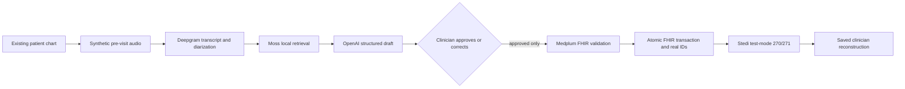
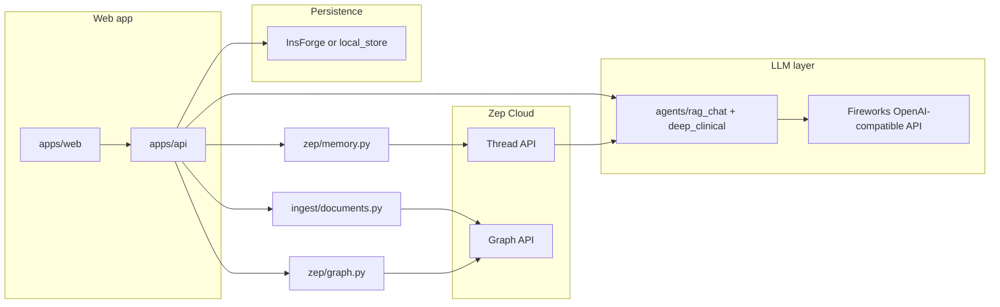
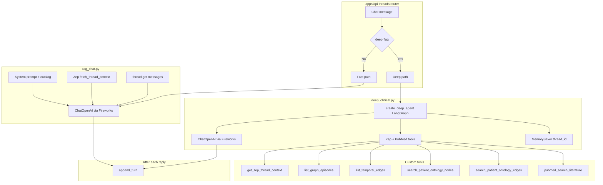
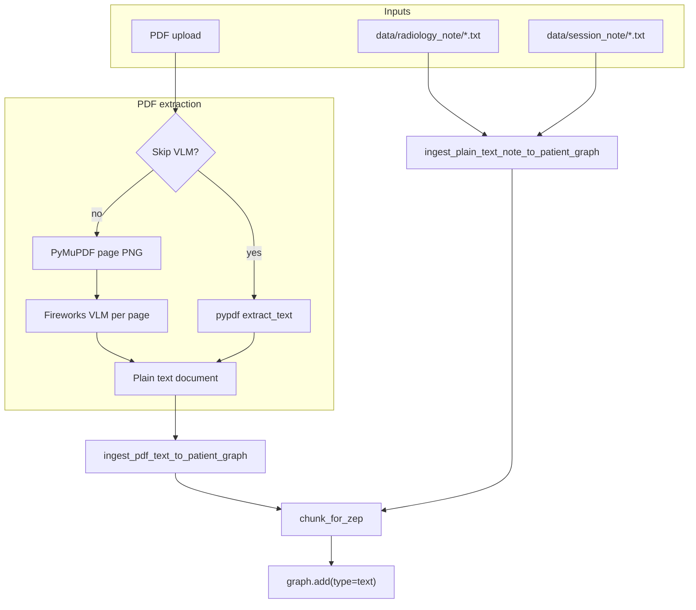

# MedTrace AI

**Clinical decision support / cognitive aid** — surfaces patterns, timelines, and test ideas for the clinician to validate. Not a certified medical device; agent and vision-ingest output are demo-grade.

One FastAPI service and one React app, sharing the `src/medtrace_agent/` Python package (`medtrace-agent` 0.2.0).

[](#yc-medplum-hackathon-demo)
[](pyproject.toml)
[](apps/api)
[](apps/web)
[](#yc-medplum-hackathon-demo)

| Surface | Path | Port |
|---------|------|------|
| API (clinical + imaging) | `apps/api/` (`apps.api.main:app`) | 8001 |
| Web app | `apps/web/` — `/`, `/patients/:id`, `/imaging`, `/session`, `/yc-medplum-hackathon-demo` | 3000 |
| Voice prototype | `services/transcription/` (optional; backs `/session`) | 8010 + 4000 |

- **Clinical** — patients, documents, chat threads, and derived views over **Zep Cloud** (memory + temporal graph), **Fireworks AI** (LLM + VLM), and **InsForge** (Postgres + Storage). Needs keys, or set `MEDTRACE_LOCAL_MOCK=1` for an offline file-backed data layer.
- **Imaging** — DICOM upload, MedSAM2 segmentation, draft reports. **Runs fully in mock mode with no secrets** — easiest path to an end-to-end demo.

**Topics:** clinical AI · pre-visit intake · evidence provenance · FHIR R4 · eligibility and benefits · human-in-the-loop review

## Contents

- [Quick start](#quick-start)
- [YC Medplum hackathon demo](#yc-medplum-hackathon-demo)
- [Monorepo layout](#monorepo-layout)
- [Architecture](#architecture)
- [Configuration](#configuration)
- [Tests](#tests)
- [Security and hygiene](#security--hygiene)
- [Provenance and license](#provenance-and-license)

| Capability | Status |
|---|---|
| Existing chart, longitudinal labs, timeline, imaging, and Zep chat | Implemented |
| Deepgram → Moss → OpenAI pre-visit draft | Source-complete; live credentials required |
| Clinician-gated Medplum validation and transaction write | Source-complete; live credentials required |
| Stedi constrained test-mode eligibility | Source-complete; exact supported synthetic test case required |
| Guaranteed final visit price | Not supported by 270/271 eligibility; intentionally not claimed |
| AI-led realtime conversational interview | Not implemented; current demo is a recorded/uploaded two-speaker check-in |
| 3D body/biometric visualization | Not implemented; existing longitudinal charts are 2D |

---

## Quick start

PowerShell:

```powershell
python -m venv .venv
.venv\Scripts\Activate.ps1
python -m pip install -e ".[dev,imaging]"

npm install
npm --prefix apps/web ci

Copy-Item .env.example .env
# Fill ZEP / FIREWORKS / INSFORGE keys, or set MEDTRACE_LOCAL_MOCK=1 for an offline dashboard.

npm run dev          # api :8001, web :3000
```

macOS/Linux:

```bash
python -m venv .venv
source .venv/bin/activate
python -m pip install -e ".[dev,imaging]"

npm install
npm --prefix apps/web ci

cp .env.example .env
# Fill ZEP / FIREWORKS / INSFORGE keys, or set MEDTRACE_LOCAL_MOCK=1 for an offline dashboard.
# Imaging works without secrets (deterministic mock).

npm run dev          # api :8001, web :3000
```

| Script | Starts |
|--------|--------|
| `npm run dev` | api + web |
| `npm run dev:api` | FastAPI only |
| `npm run dev:web` | Vite only |
| `npm run dev:transcription` | voice backend (8010) + CopilotKit runtime (4000) |
| `npm run lint` / `npm run build` | TypeScript check / Vite build (`apps/web`) |
| `npm run test:py` | `python -m pytest -m "not integration"` in the activated venv |

Health check: `curl http://127.0.0.1:8001/api/health`
Web (Vite binds IPv6 `localhost`): `curl http://localhost:3000`

---

## YC Medplum hackathon demo

Open [`http://localhost:3000/yc-medplum-hackathon-demo`](http://localhost:3000/yc-medplum-hackathon-demo). The route composes the existing chart and visual system; it does not replace the dashboard or create a parallel patient database.



The intended storyboard targets **2:45** and must stop before **3:00**. This is a source-level target, not yet a timed live-provider recording; rehearse and time the final credentialed run before submission.

1. Open the existing synthetic patient chart and show diabetes, worsening HbA1c, medication history, penicillin rash, longitudinal biometrics, and the timeline.
2. Paste the runtime-only operator token, choose which Deepgram speaker is the patient, and record or upload a 30–40 second two-speaker synthetic check-in.
3. Show real Deepgram speaker/timestamp evidence, the non-persisted Moss session result, and the OpenAI proposal. Correct the reviewed clinical fields if needed, then approve.
4. Show Medplum validation success and the actual FHIR resource IDs. No clinical FHIR write occurs before approval.
5. Run Stedi's official constrained Aetna/Jane Doe test case and show qualifier-aware synthetic benefits. Do not present it as a payer response or a final price.
6. Close on the saved readiness view and ask: “What changed today, what should the clinician verify, and what evidence supports it?”

The route has no application-generated sponsor fallback. Missing credentials fail visibly. Stedi itself returns Stedi-generated synthetic test data and does not contact a payer. Use synthetic data only: Moss currently lists HIPAA support on Enterprise.

### Provision the one cross-provider synthetic patient

The demo deliberately refuses an arbitrary InsForge chart. The selected chart must be Jane Doe (`2004-04-04`), carry the `synthetic` tag, bind to the exact Medplum Patient ID, and identify Stedi test case `aetna-jane-doe-20040404`. The reciprocal Medplum Patient must carry:

- `meta.tag`: system `https://github.com/ayushozha/medtrace-previsit/tags`, code `synthetic-demo`;
- `identifier`: system `https://github.com/ayushozha/medtrace-previsit/insforge-chart-subject-id`, value equal to the InsForge chart ID.

After configuring real InsForge, Zep, and Medplum ClientApplication credentials, provision the existing rich synthetic chronic-care fixture and its crosswalk:

```powershell
# Creates a new explicitly tagged Medplum Patient only when MEDPLUM_PATIENT_ID is blank.
python scripts/provision_yc_demo_patient.py --create-medplum-patient

# Copy the printed values into .env, then restart the API.
# YC_DEMO_PATIENT_ID=<printed chart id>
# MEDPLUM_PATIENT_ID=<printed FHIR id>
```

The script reuses the existing longitudinal chart fixture, writes the synthetic history to real Zep, persists the chart in real InsForge, creates or verifies the tagged Medplum Patient, and prints the exact IDs. It does not provision Stedi credentials.

Generate the two workflow secrets separately; reusing them is rejected:

```powershell
python -c "import secrets; print(secrets.token_urlsafe(32))"
python -c "import secrets; print(secrets.token_urlsafe(32))"
```

Set the first as `YC_DEMO_CHECKIN_SIGNING_KEY`, the second as `YC_DEMO_ACCESS_TOKEN`, and set server-owned `YC_DEMO_OPERATOR_ID` / `YC_DEMO_OPERATOR_NAME`. The browser asks for the access token at runtime, retains it only in dialog memory, and cannot choose approval provenance.

### Demo API surface

All patient-scoped operations require `X-MedTrace-Demo-Token`; `/api/demo/status` is public but exposes only configuration presence and the synthetic chart ID.

| Method | Path | Purpose | Important failure behavior |
|---|---|---|---|
| `GET` | `/api/demo/status` | Presence-only provider/workflow configuration | Does not test provider connectivity |
| `POST` | `/api/demo/patients/{id}/checkins` | Bounded audio → Deepgram → per-check-in Moss session → OpenAI reviewed draft | Rejects local mock, non-synthetic binding, invalid speaker selections or selections with no diarized utterances, recordings over 60 seconds, and missing providers |
| `POST` | `/api/demo/patients/{id}/checkins/confirm` | Verify signed source evidence, journal approval, validate FHIR, commit one conditional transaction, refresh Zep | `approved=false` never builds/writes FHIR; retries reuse the check-in ID |
| `POST` | `/api/demo/patients/{id}/eligibility` | Run the exact Stedi test tuple and persist normalized benefit fields to Medplum | Requires a completed validated check-in; never stores the raw Stedi payload |
| `GET` | `/api/demo/patients/{id}/readiness` | Reconstruct the completed clinician view | Rejects partial workflow journals |

Audio is sent to Deepgram but is not persisted by this repository. OpenAI Responses is called with `store=False`. The full diarized transcript is displayed for review; only cited patient-speaker utterances, reviewed changes, provider IDs, validation results, and normalized Stedi fields are retained in InsForge/Zep/Medplum. Moss receives credentials/session creation through its control plane, uses a unique per-check-in local session, has telemetry disabled with `MOSS_DISABLE_TELEMETRY=1`, and is never pushed with `push_index()`.

### Cost language

Stedi's official test response can demonstrate coverage, network, copay, coinsurance, deductible, out-of-pocket, coverage-level, and time qualifiers. It is synthetic and not sent to a payer. A 270/271 response also does not provide the negotiated allowed amount or final claim adjudication. The UI therefore shows **patient-responsibility summary: not determinable from test-mode eligibility alone** and labels every returned amount with its qualifiers rather than inventing a total.

### Moss package constraint

The Python integration pins `moss==1.7.2`, which installs the platform-specific `inferedge-moss-core==0.21.0` binary. The published artifacts use the PolyForm Shield license even though the public repository advertises BSD-2-Clause. Hackathon evaluation appears to fit the published evaluation allowance, but production/commercial use needs written sponsor confirmation and deployment-platform verification.

---

## Monorepo layout

```
apps/
  api/               FastAPI — clinical + imaging (8001)
  web/               React/Vite UI — dashboard, imaging, session (3000)
services/
  transcription/     Voice/CopilotKit prototype (8010, 4000)
src/medtrace_agent/  Shared package (Zep, ingest, agents, imaging, InsForge, ontology)
tests/               Pytest suite (covers the shared package)
migrations/          InsForge SQL migrations
mock/patient_data/   Synthetic patient fixtures (local-mock seed source)
data/                Runtime data (local_mock, notes, studies; mostly gitignored)
notebooks/           Colab workflows (MedGemma QLoRA training + evaluation)
scripts/             Ontology apply, note ingest, seeding, local-mock reset, model probe
```

---

## Architecture



- **Web** talks only to port 3000; Vite proxies `/api` and `/data` to the API, and `/api/copilotkit` to the transcription runtime.
- **Agent** — default `chat_with_memory` (one LLM call with Zep context + document catalog). Optional Deep Agent (`deep` flag) uses Zep tools + PubMed.
- **Zep** — conversational turns on **threads**; durable episodes/facts/ontology on the **user graph**.
- **InsForge** — chart/document/session rows only. Clinical dashboard fields are derived per request from Zep (no SQL mirror). Local mock fakes InsForge via `data/local_mock/`.

### LLM layer

Every chat and PDF-vision call goes through `fireworks_chat_client()` (`medtrace_agent.fireworks_config`) against an **OpenAI-compatible** endpoint — **Fireworks AI** by default (`FIREWORKS_BASE_URL`, `FIREWORKS_MODEL`, `FIREWORKS_VL_MODEL`).

- `FIREWORKS_VLM_API` — `chat` (`/v1/chat/completions`, default) or `completions` (`<image>`-prompt style).
- `FIREWORKS_REASONING_EFFORT=none` — keeps Qwen3-style CoT out of `reasoning_content` so JSON/text lands in `content`.
- Any OpenAI-compatible host works if you repoint those env vars (including a self-hosted [vLLM](https://docs.vllm.ai/en/latest/serving/openai_compatible_server/) server).

Fireworks retires serverless model ids often; a stale id fails as `404 Model not found`, not auth. Run `scripts/fireworks_probe_models.py` to list what your key can reach.

### AI agent paths

How the API chooses between **fast RAG chat** and the **Deep Clinical Agent** (`deep` on `POST /api/threads/{id}/messages`):



| Path | Role |
|------|------|
| **Fast** | Single `chat_with_memory` call: system prompt + Zep context + recent messages + document catalog. No tool loop. |
| **Deep** | `create_deep_agent` with Zep graph tools + PubMed (`integrations/pubmed` via NCBI E-utilities). Slower; educational demo only. |
| **PubMed** | Set `NCBI_EMAIL` (and optionally `NCBI_API_KEY`) for reliable E-utilities access. |

### Imaging

`MedSAM2Service` / report adapters resolve in order: **HTTP endpoint** → **local adapter** → **deterministic mock**. Reports use Qwen VL via Nebius only when both `NEBIUS_API_KEY` and env-driven `NEBIUS_QWEN_VL_MODEL` are set; a partial pair fails visibly instead of silently falling back. DICOM previews use pydicom with rescale + windowing; ROI prompts are normalized 0–1 and converted to pixels server-side.

Sample DICOM for uploads (ships with pydicom):

```bash
.venv/bin/python -c "import pydicom.data,os;print(os.path.join(os.path.dirname(pydicom.data.__file__),'test_files','MR_small.dcm'))"
```

### Local mock mode

`MEDTRACE_LOCAL_MOCK=1` runs the dashboard **without InsForge**:

- Persistence routes to `local_store` (`data/local_mock/store.json`), auto-seeded from `mock/patient_data/`.
- Reset with `scripts/reset_local_mock.py`.
- **Chat and ingest still need Zep + Fireworks** — only the InsForge layer is faked.

---

## Zep: thread vs graph

A patient is a Zep **user** (`zep_user_id`).

### Thread (short dialog + rolling context)

- `thread.get_user_context(thread_id)` — synthesized context for the model.
- `thread.get(thread_id, lastn=…)` — recent messages for LangChain history.
- `thread.add_messages` — appends user + assistant turns after each reply.

New thread = new conversation, same user (long-term recall stays attached to the patient).

### Graph (episodes, facts, ontology)

- `graph.add` — PDF/note chunks as text episodes (metadata: `doc_id`, filename, `kind`, …).
- `graph.set_ontology` — clinical entity/edge types (`AUTO_APPLY_ZEP_ONTOLOGY=true` at API startup).
- `graph.search` / episode + edge APIs — power derived clinical views and Deep Agent tools.

**Ontology is a startup dependency.** If registration is skipped, clinical endpoints return empty arrays with 200. Re-apply with `scripts/apply_ontology.py`.

---

## Chat turn sequence

1. User sends a message in the web app.
2. `fetch_thread_context(thread_id)` → Zep context string + last N messages.
3. Document catalog is built from the InsForge / local-mock registry for that patient.
4. **Default:** `chat_with_memory` — one LLM call. **Deep:** `run_clinical_deep_agent_turn` with tools + `MemorySaver`.
5. `append_turn` writes both sides to Zep via `thread.add_messages`.

---

## Document ingestion

**Default (vision):** each PDF page is rasterized (PyMuPDF) and sent to the Fireworks multimodal model; JSON is validated then serialized to plain text.

**Skip VLM:** `pypdf` reads the embedded text layer only — faster, but no scans/handwriting.

Then chunks go to Zep via `chunk_for_zep` → `graph.add(type="text")`.



| Source | Typical `kind` | Chunk header |
|--------|----------------|--------------|
| PDF (VLM or Skip VLM) | `pdf_medical_history` | `[ClinicalDocument …]` |
| `data/radiology_note/*.txt` | `radiology_note` | `[RadiologyNote …]` |
| `data/session_note/*.txt` | `session_note` | `[SessionNote …]` |

**Cost:** one multimodal call per page. Cap with `PDF_VL_MAX_PAGES` (default 25) / `PDF_VL_DPI` (default 150), or the upload form's `dpi` / `max_pages`. Vision models can misread numbers or hallucinate fields — treat as demo-grade.

---

## Module map

| Module | Role |
|--------|------|
| `apps/api/routers/threads.py` | Chat turn → fast or deep path, then `append_turn` |
| `apps/api/routers/clinical.py` | Conditions, meds, labs, alerts, timeline from Zep |
| `apps/api/routers/studies.py` | DICOM upload, segmentation, draft reports |
| `medtrace_agent.agents.rag_chat` | `chat_with_memory` — single LLM call |
| `medtrace_agent.agents.deep_clinical` | Deep Agent + Zep/PubMed tools |
| `medtrace_agent.zep.memory` / `zep.graph` | Thread lifecycle + graph inspector |
| `medtrace_agent.ingest.documents` / `scan_extract` | PDF/note → Zep graph |
| `medtrace_agent.ontology.clinical` | Entity/edge ontology; auto-applied at startup |
| `medtrace_agent.insforge_api` / `local_store` | InsForge registry + local-mock twin |
| `medtrace_agent.fireworks_config` | Sole `ChatOpenAI` construction point |
| `medtrace_agent.imaging.*` | Study paths, DICOM preview, MedSAM2 / report adapters |

---

## Configuration

See **`.env.example`** for every variable. Comments must be on their own lines — dotenv treats trailing `# ...` as part of the value.

| Area | Variables |
|------|-----------|
| **LLM** | `FIREWORKS_API_KEY`, `FIREWORKS_BASE_URL`, `FIREWORKS_MODEL`, `FIREWORKS_VL_MODEL`, `FIREWORKS_VLM_API`, `FIREWORKS_REASONING_EFFORT` |
| **Memory** | `ZEP_API_KEY`, `AUTO_APPLY_ZEP_ONTOLOGY` |
| **Persistence** | `INSFORGE_URL`, `INSFORGE_ANON_KEY`, `INSFORGE_API_KEY`, `INSFORGE_PROFILE_ID` — or `MEDTRACE_LOCAL_MOCK=1` |
| **PDF caps** | `PDF_VL_MAX_PAGES`, `PDF_VL_DPI` |
| **PubMed** | `NCBI_EMAIL`, `NCBI_API_KEY` (optional) |
| **Voice `/session`** | `GEMINI_API_KEY` (transcription); `OPENAI_*` for report agent / TTS (can point at Fireworks for chat) |
| **Imaging draft** | `NEBIUS_API_KEY`, `NEBIUS_BASE_URL`, and `NEBIUS_QWEN_VL_MODEL` are an all-or-nothing pair/path |
| **YC demo workflow** | `YC_DEMO_PATIENT_ID`, distinct 32+ character `YC_DEMO_CHECKIN_SIGNING_KEY` and `YC_DEMO_ACCESS_TOKEN`, plus server-owned `YC_DEMO_OPERATOR_ID` / `YC_DEMO_OPERATOR_NAME` |
| **Deepgram** | `DEEPGRAM_API_KEY`, `DEEPGRAM_MODEL`, `DEEPGRAM_DIARIZE_MODEL` (`latest`, `v1`, or `v2`) |
| **Moss** | `MOSS_PROJECT_ID`, `MOSS_PROJECT_KEY`, `MOSS_INDEX_NAME`, `MOSS_MODEL_ID`, required `MOSS_DISABLE_TELEMETRY=1`; endpoint overrides must be unset |
| **OpenAI demo extraction** | `OPENAI_API_KEY`, `OPENAI_MODEL`; leave `OPENAI_BASE_URL` empty for OpenAI |
| **Medplum** | `MEDPLUM_CLIENT_ID`, `MEDPLUM_CLIENT_SECRET`, `MEDPLUM_PATIENT_ID`, reciprocal synthetic tag/chart identifier |
| **Stedi test mode** | `STEDI_TEST_API_KEY` plus the exact documented Aetna/Jane Doe values already shown in `.env.example` |
| **CORS** | `API_CORS_ORIGINS` (defaults include localhost:3000) |

Clinical data routes return **503** without InsForge or local mock. Imaging routes never do (they degrade to mock). Chat/ingest fail without Fireworks + Zep even in local-mock mode.

---

## MedGemma fine-tuning in Colab

[`notebooks/finetune_medgemma_colab.ipynb`](notebooks/finetune_medgemma_colab.ipynb) runs a reproducible QLoRA SFT workflow for `google/medgemma-4b-it` on an A100 Colab runtime. The notebook calls [`scripts/finetune_medgemma_colab.py`](scripts/finetune_medgemma_colab.py), which:

- loads a Hugging Face `DatasetDict`, a local/Drive `save_to_disk()` dataset, or JSON/JSONL;
- requires `image`, `prompt`, and clinician-reviewed `response` columns;
- uses an existing validation split or creates a deterministic patient/study-level split via `patient_id` (configurable);
- logs losses and aggregate base-vs-tuned evaluation metrics to W&B;
- keeps raw evaluation prompts and predictions out of W&B unless explicitly enabled;
- saves the LoRA adapter locally and optionally publishes it to a private Hugging Face repository only when the configured evaluation gates pass.

Add `HF_TOKEN` and `WANDB_API_KEY` through Colab Secrets; never paste them into the notebook. MedGemma is gated, so accept its Hugging Face usage terms before starting. For report tuning, each `response` should be JSON containing `summary`, `findings`, `impression`, `recommendation`, and numeric `confidence`.

The included ROUGE, exact-match, JSON-validity, and loss checks are engineering signals—not clinical validation. Use de-identified data and add clinician-reviewed task metrics, subgroup analysis, calibration, and failure-mode review before promoting a model.

---

## Tests

PowerShell (after activating `.venv`):

```powershell
python -m pytest -m "not integration"   # or: npm run test:py
python -m pytest tests/unit/test_rag_chat.py
```

macOS/Linux:

```bash
python -m pytest -m "not integration"   # or: npm run test:py
python -m pytest tests/unit/test_rag_chat.py
```

Tests cover shared agent modules and focused demo-router orchestration. Live sponsor credentials are still required to verify provider responses and Medplum `$validate` behavior end to end. The `integration` marker hits the live NCBI PubMed API.

---

## Dependency highlights

- **zep-cloud** — thread + graph APIs
- **langchain-openai** / **deepagents** — `ChatOpenAI` + Deep Agent path
- **fastapi** / **uvicorn** — `apps/api`
- **pypdf** / **pymupdf** / **pydantic** — PDF extract + VLM JSON validation
- **pydicom** / **numpy** / **pillow** — imaging extra (`pip install -e ".[imaging]"`)
- **openai** — Responses API structured extraction with Pydantic schemas
- **moss** / **inferedge-moss-core** — local session retrieval for the voice evidence path

---

## Security & hygiene

- Never commit `.env` or secrets. `INSFORGE_API_KEY` is server-side only.
- `data/` (studies, local mock, uploaded notes) is largely gitignored — do not commit real PHI. Fixtures in `mock/patient_data/` are synthetic.
- Do not widen CORS to `*` for the main API.
- The hackathon route rejects `MEDTRACE_LOCAL_MOCK=1`; sponsor credentials remain server-side. Only the dedicated, separately generated demo access token enters browser memory.
- `YC_DEMO_ACCESS_TOKEN` is a temporary hackathon operator gate, not production clinician authentication or RBAC. Replace it with authenticated clinician claims before any real deployment.
- Use only synthetic audio and patient/member data until appropriate BAAs, retention controls, and production agreements exist.
- Agent output is non-diagnostic clinical decision support, not a medical device.

---

## Provenance and license

This hackathon-focused repository is a fresh snapshot of
[`pramodthe/MedTrace-AI`](https://github.com/pramodthe/MedTrace-AI) at commit
`2ceb13fb819e5b2d1a6fc108864ab51bc84e8826`. The upstream history remains the
authoritative record of prior contributors.

No license file is currently checked in. Public visibility does not grant reuse,
redistribution, or production-use rights; contact the repository owners before
using this code outside the hackathon.
